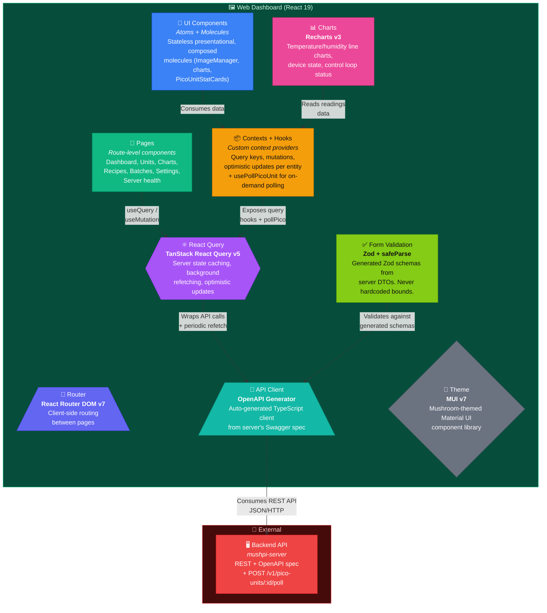

This page maps the inside of `mushpi-client` — the React 19 web dashboard. It shows the router, the React Query data layer, the per-entity contexts, the UI components, the chart tabs, and the auto-generated API client that connects everything to the backend.



## Directory Structure

```
src/
├── api/
│   ├── client.ts             # Axios instance with base URL
│   ├── adapter.ts            # Cache adapter
│   ├── generated/             # AUTO-GENERATED — never edit
│   │   ├── api.ts            # API client classes
│   │   └── schemas.ts        # Zod validation schemas
│   └── queryKeys.ts          # React Query key factories
├── assets/                   # Static SVGs (~assets)
├── components/
│   ├── ui/
│   │   ├── atoms/            # Stateless presentational (Button, Card, Input)
│   │   ├── molecules/        # Composed (ImageManager, charts)
│   │   └── index.ts
│   ├── provisioning/         # Provisioning & reconnect UI (LedStateReference, ReconnectPicoDialog)
│   ├── BatchForm.tsx         # Shared batch form
│   ├── PicoUnitForm.tsx      # Shared Pico unit form
│   └── RecipeForm.tsx        # Shared recipe form
├── contexts/                 # Context + hooks + mutations per entity (8)
│   ├── PicoUnit/             # PicoUnitProvider + usePicoUnitContext
│   ├── PicoUnits/            # usePicoUnits, mutations/
│   ├── Recipe/               # useRecipe, mutations/
│   ├── Recipes/              # useRecipes, mutations/
│   ├── Batch/                # useBatch, mutations/
│   ├── Batches/              # useBatches, mutations/
│   ├── Charts/               # ChartsProvider, BatchChartsProvider
│   └── Toast.tsx
├── hooks/                    # 9 hooks + BatchForm/ + RecipeForm/
├── interfaces/               # Shared TS interfaces
├── layout/                   # Page wrapper, Sidebar
├── pages/                    # 10 route pages, one <PageName>/index.tsx each
├── styles/                   # global.css + variables.css (pre-mount token mirror)
├── test/                     # setup.ts, fixtures.tsx
├── theme/
│   ├── tokens.ts             # Sole colour source — never hardcode colours
│   ├── mushroomTheme.ts      # MUI theme built from tokens
│   └── tokens.test.ts        # Colour-source guard
├── types/                    # Shared TS types
└── utils/methods.ts          # Pure helpers (chart sampling, dedup)
```

## Pages & Routes

| Route | Page | Description |
|-------|------|-------------|
| `/` | Dashboard | Overview of all units, recent readings, active batches |
| `/pico-units` | Units List | Table of all Pico units with status indicators |
| `/pico-units/:id` | Unit Detail | PicoUnitStatCards (live temp/humidity), technical details (firmware/API version), sensor readings, setpoints, relay controls, batch list |
| `/readings` | Charts | Temperature/humidity charts across units |
| `/recipes` | Recipes List | Recipe catalog with images |
| `/recipes/:id` | Recipe Detail | Recipe details, linked batches, image management |
| `/batches` | Batches List | All cultivation batches with status |
| `/batches/:id` | Batch Detail | Batch info, readings charts, image gallery |
| `/server` | Server Health | Backend health metrics |
| `/settings` | Settings | Timezone selection with MUI Autocomplete |

## On-Demand Polling & Live Refresh

The client uses `usePollPicoUnit` (a TanStack mutation wrapping `POST /v1/pico-units/:id/poll`) for immediate hardware state refresh. It returns an updated `PicoUnit` with `latest_reading` embedded. Exposed via `pollPico` on the Pico unit context (`PicoUnitProvider` + `usePicoUnitContext`).

### Refresh triggers

| Trigger | Where | What happens |
|---------|-------|--------------|
| **Page mount** | Unit detail (`/pico-units/:id`), Readings page | `pollPico()` called on navigation for fresh hardware data |
| **Post-mutation** | After any control change (setpoints, outputs, control loop toggle, setup) | Pico is automatically re-polled after the mutation completes |
| **Periodic background** | Unit detail page | `pollPico()` every 60 s for live hardware data |
| **Periodic DB refetch** | Readings page, Batch detail | `refetchInterval: 60_000` on readings/batch-readings queries |

### PicoUnitStatCards

The unit detail page displays **temperature (°C)** and **humidity (%)** stat cards showing the latest sensor readings. Each card shows a spinner during poll-in-progress for live-update feedback.

### Firmware & API Version Display

The unit detail page's **Technical details** card shows each unit's reported version metadata:

- **Firmware version** — the `firmware_version` the unit last reported (relabelled from the legacy `software_version` field).
- **API version** — the unit's `api_version` (Pico↔Server contract generation), with a tooltip clarifying it is *not* the server's `/v1/` URI prefix.

The fleet list's unit card also shows a version caption. Both fields render a disabled "hasn't reported yet" state when the server has no stored value (a unit that has not announced since the field was introduced).

### Pin Mapping Dialog (`PicoUnitMapping/`)

The unit detail page provides a **pin mapping dialog** for reconfiguring GPIO assignments at runtime:

- **`MappingDialog.tsx`** — modal with a warning banner, acknowledge checkbox (gate), 4 pin number inputs (valid GPIOs: 0–22, 26–28), live changes preview highlighting modified rows, and a link to pico2w.pinout.xyz.
- **`MappingInfo.tsx`** — read-only card showing live pin assignments from the Pico (sourced from `pico.devices` in poll responses).
- **`MappingPreview.tsx`** — stateless current→proposed comparison component.
- **`changeSetup` mutation** — calls `PUT /v1/pico-units/:id/control/setup` via auto-generated client; the server validates GPIOs against `VALID_USER_GPIO_PINS` (excludes WiFi-reserved GP23/24/25/29) and enforces no-duplicate-pin constraint (returns 422) — checked against the merged view of the unit's live mapping and the partial update, so a partial update reusing a GPIO already assigned on the unit is rejected with 422 and `GPIO <pin> is already assigned to the <device>` (e.g. `GPIO 6 is already assigned to the humidifier`) before anything is forwarded to the unit.
- **`active_high` (relay polarity) is deliberately excluded** from the UI — it is relay configuration, not pin mapping.

The `MappingInfo` card gates on `pico` only (not `latest_reading`), since pin mapping is independent of sensor data — a separate pattern from Controls/Devices cards.

## Charts

Three chart tabs shared across `/readings` (unit view) and `/batches/:id` (batch view):

| Tab | Component | Data |
|-----|-----------|------|
| Temperature + Humidity | `TempHumTab` | Line chart: temp and humidity over time |
| Devices | `DevicesTab` | Binary on/off: fan, humidifier, heater status |
| Control Loop | `ControlLoopTab` | Binary on/off: whether the automatic control loop was active |

## Form Validation Pattern

1. `toDto()` — converts string form values to DTO types (empty → undefined, non-empty → Number())
2. `safeParse()` — validates against generated Zod schema
3. `issue.message` — used directly, no rewriting
4. `isValid` = `!Object.values(errors).some(Boolean)`
5. Submit disabled until `hasChanges && isValid` (edit) or `isValid` (create)
