This page maps the inside of `mushpi-grow` — the MicroPython firmware running on the Raspberry Pi Pico 2W. It shows the entry point, the Wi-Fi lifecycle, the REST API, the hysteresis control loop, the shared state, and the hardware it drives.

```mermaid
flowchart TB
    subgraph GROW["🌱 Pico Firmware (MicroPython, Pico 2W)"]
        direction TB

        MAIN("🚀 main.py<br/><b>Entry Point</b><br/>Startup sequence, WiFi connect/<br/>AP fallback, spawns async tasks")

        API[/"🌐 API Server<br/><b>Microdot (port 5000)</b><br/>STA: REST endpoints — sensors,<br/>setpoints, outputs, control, setup,<br/>ping, health, system, reboot<br/>AP: HTML provisioning form +<br/>POST /provision"\]

        CONTROL>"🔄 Control Loop<br/><b>app/control.py</b><br/>Hysteresis-based coroutine —<br/>reads sensor, toggles relays;<br/>owns control_enabled (asyncio.Event)<br/>+ min-runtime tracking (STA only)"]

        SENSOR["🌡️ DHT Reader<br/><b>app/sensor.py</b><br/>Reads DHT11, validates<br/>plausibility, updates shared state"]

        HW["⚡ IO Layer<br/><b>app/hw.py</b><br/>GPIO init, relay control,<br/>LED heartbeat & provisioning blink"]

        WIFI["📶 Wi-Fi Lifecycle<br/><b>app/wifi.py</b><br/>connect_wifi() (boot),<br/>reconnect_once_async() (runtime),<br/>wifi_watchdog_loop() (link monitor<br/>with backoff → re-announce on link-up)"]

        ANNOUNCE["📢 Announce<br/><b>app/announce.py</b><br/>POSTs device presence to server<br/>(incl. MAC + version metadata),<br/>re-entrant: boot + link-up re-announce<br/>(STA mode only)"]

        SHUTDOWN["🛑 Shutdown<br/><b>app/shutdown.py</b><br/>graceful_shutdown(),<br/>reboot(), soft_reboot(),<br/>stop_event"]

        METRICS["📈 Metrics<br/><b>app/metrics.py</b><br/>RAM, filesystem, WiFi RSSI,<br/>MCU temp, uptime, loop util %"]

        CONFIG{"⚙️ Config Loader<br/><b>app/config_loader.py</b><br/>load_config(): shallow-merge<br/>config.json over defaults<br/>save_config(): atomic write<br/>(.tmp + os.rename)"}

        VALIDATOR["✅ Config Validator<br/><b>app/config_validator.py</b><br/>Boot-time field validation<br/>Types, ranges, required keys<br/>Accumulates all errors"]

        UPTIME["⏱️ Uptime Tracker<br/><b>app/uptime.py</b><br/>Cumulative uptime across<br/>scheduled reboots, boot-reason<br/>classification (reset_cause)"]

        SCHEDULER>"🕐 Reboot Scheduler<br/><b>app/reboot_scheduler.py</b><br/>NTP sync + daily scheduled<br/>soft_reset() at configured<br/>hour (STA mode only)"]

        PROV_HTML{"📋 Provisioning HTML<br/><b>app/provision.html</b><br/>Dark-themed form matching<br/>MushPi visual identity"}

        STATE[("💾 Shared State<br/><b>app/state.py</b><br/>Mutable dicts: status, setpoints,<br/>devices<br/>Cached: _system_info<br/>(incl. wifi.mac)")]
    end

    subgraph EXTERNAL["🔗 External Systems"]
        SERVER["🖥️ Backend API<br/><i>mushpi-server</i><br/>Polls GET /, sends PUT<br/>control commands"]
        BROWSER("👤 Grower Browser<br/><i>Phone or laptop</i><br/>Connects to Pico AP for<br/>Wi-Fi provisioning")
    end

    subgraph HARDWARE["🔌 Hardware"]
        DHT11{{"🌡️ DHT11 Sensor<br/><b>GPIO 4</b><br/>Temperature + humidity"}}
        RELAY{{"⚡ Relay Module<br/><b>GPIO 6, 7, 8</b><br/>Humidifier, Fan, Heater"}}
        GP0{{"🔘 GP0 — Force Provision<br/><b>Internal pull-up</b><br/>Hold LOW at boot to<br/>force AP mode"}}
    end

    SERVER -->|"GET / (polling), PUT<br/>/setpoints, /outputs,<br/>/control, /setup,<br/>/reboot (soft/hard)"| API
    BROWSER -.->|"Wi-Fi Direct (AP mode)<br/>GET / → HTML form<br/>POST /provision"| API
    API -.->|"Writes credentials via<br/>save_config()"| CONFIG
    PROV_HTML -.->|"Rendered by<br/>GET / (AP mode)"| API

    CONTROL -->|"Reads setpoints,<br/>writes status & devices"| STATE
    SENSOR -->|"Writes temperature<br/>& humidity to status"| STATE
    HW -->|"Reads devices dict<br/>to set GPIOs"| STATE
    ANNOUNCE -->|"Reads system_info<br/>(handle, MAC, IP, port)"| STATE

    MAIN -->|"Starts Microdot<br/>server (STA or AP)"| API
    MAIN -->|"Spawns control<br/>loop coroutine"| CONTROL
    MAIN -->|"Boot connect +<br/>spawns link watchdog"| WIFI
    MAIN -->|"Spawns announcement<br/>on boot"| ANNOUNCE
    MAIN -->|"Spawns loop<br/>utilization meter"| METRICS
    MAIN -->|"Reads config<br/>on boot"| CONFIG
    MAIN -->|"Validates config<br/>(boot gate)"| VALIDATOR
    MAIN -->|"Spawns daily<br/>reboot scheduler"| SCHEDULER
    MAIN -->|"Classifies reboot<br/>reason on boot"| UPTIME
    MAIN -->|"Provisioning blink<br/>(AP mode)"| HW
    MAIN -->|"finally calls<br/>graceful_shutdown()"| SHUTDOWN

    WIFI -.->|"Re-announce on<br/>link-up"| ANNOUNCE

    SCHEDULER -->|"Persists cumulative<br/>uptime before reset"| UPTIME
    VALIDATOR -->|"Reads merged<br/>config for validation"| CONFIG
    ANNOUNCE -.->|"Gradual<br/>soft_reset<br/>(preserves uptime)"| SCHEDULER

    SENSOR -->|"Reads data pin<br/>GPIO 4"| DHT11
    HW -->|"Toggles relay<br/>channels"| RELAY
    HW -->|"Reads force-provision<br/>pin at boot"| GP0

    classDef entry fill:#10b981,stroke:#059669,color:#fff
    classDef api fill:#6366f1,stroke:#4f46e5,color:#fff
    classDef loop fill:#a855f7,stroke:#9333ea,color:#fff
    classDef core fill:#3b82f6,stroke:#1d4ed8,color:#fff
    classDef config fill:#6b7280,stroke:#4b5563,color:#fff
    classDef state fill:#f59e0b,stroke:#d97706,color:#111
    classDef server fill:#ef4444,stroke:#dc2626,color:#fff
    classDef hw fill:#dc2626,stroke:#b91c1c,color:#fff
    classDef user fill:#8b5cf6,stroke:#7c3aed,color:#fff

    class MAIN entry
    class API api
    class CONTROL loop
    class SENSOR,HW,ANNOUNCE,METRICS,UPTIME,VALIDATOR,WIFI,SHUTDOWN core
    class CONFIG,PROV_HTML config
    class SCHEDULER loop
    class STATE state
    class SERVER server
    class DHT11,RELAY,GP0 hw
    class BROWSER user

    style GROW fill:#1e3a5f,stroke:#3b82f6,color:#e2e8f0
    style EXTERNAL fill:#450a0a,stroke:#ef4444,color:#fecaca
    style HARDWARE fill:#1a0a0a,stroke:#dc2626,color:#fecaca
```



## Module Responsibilities

| Module | File | Responsibilities |
|--------|------|-----------------|
| **Entry Point** | `main.py` | Wires everything together. Sequence: IO init → DHT init → load config → check GP0 force-provision → WiFi connect (STA) or AP fallback → `attach_wlan_info(…)` (caches MAC, IP, hostname, port) → spawn async tasks → start Microdot server. The `finally` block calls `graceful_shutdown()` to turn outputs off and disconnect Wi-Fi. |
| **API Server** | `app/api.py` | REST API on port 5000. **STA mode**: `GET /` (full snapshot), `/ping`, `/health`, `/system`, `/sensors`, `/setpoints`, `/outputs`, `/control`, `/setup`, `/reboot`. **AP mode**: `GET /` (HTML provisioning form), `POST /provision`. CORS headers on all responses. |
| **Control Loop** | `app/control.py` | Async coroutine (STA only). Every `period_s` seconds: humidifier ON when `humidity ≤ target`, OFF when exceeded. Fan ON when `humidity > target + hyst_hum`, OFF when `≤ target + hyst_hum`. Deadband between `target` and `target + hyst_hum` prevents actuator fighting. Heater ON when `temperature ≤ target`, OFF when exceeded (thermal lag provides natural damping). Humidifier and fan mutually exclusive. Not started in AP mode. Owns control enablement as an `asyncio.Event` (`set_control_enabled()` / `is_control_enabled()`) — not shared state. Tracks minimum relay runtime via `mark_relay_on()` / `mark_relay_off()` / `reset_on_since()`; the `POST /outputs` manual override is the one sanctioned path that also calls these helpers so min-runtime tracking stays consistent. |
| **DHT Reader** | `app/sensor.py` | Reads DHT11. Validates plausibility (-10°C ≤ t ≤ 60°C, 0% ≤ h ≤ 100%). Updates shared `status` dict. Supports `?force=1` for on-demand measurement. |
| **IO Layer** | `app/hw.py` | Initializes all GPIO pins. Toggles relays (respects `active_high` config). Manages the onboard LED — its five states (OFF, SOLID, HEARTBEAT, SLOW DOUBLE-BLINK, CONFIG ERROR) are documented in [Pico Unit Status Indicators](/hardware/status-indicators). Reads GP0 at boot for force-provision. |
| **Wi-Fi Lifecycle** | `app/wifi.py` | Owns every Wi-Fi state transition: `connect_wifi()` (blocking boot connect), `reconnect_once_async()` (async runtime reconnect), and `wifi_watchdog_loop()` (link monitor with backoff that triggers a re-announce on link-up). |
| **Announce** | `app/announce.py` | POSTs device info to the server's `POST /v1/pico-units/announce` — on boot and again at runtime when Wi-Fi reconnects. The payload includes the `mac` field (lowercase colon-separated hex, e.g. `"28:cd:c1:01:23:45"`), sourced from cached `system['wifi']['mac']` populated during `attach_wlan_info()`, plus `firmware_version` (from `_SOFTWARE_VERSION`) and `api_version` (from `_API_VERSION`). The function is idempotent/re-invocable; on failure it retries once after a 60 s delay. Skipped in AP mode. |
| **Shutdown** | `app/shutdown.py` | `graceful_shutdown()` (turns all outputs off, disconnects Wi-Fi), `reboot()`, `soft_reboot()`, and the shared `stop_event` that long-running loops check to exit cleanly. |
| **Metrics** | `app/metrics.py` | Provides system snapshot: free RAM, filesystem free blocks, WiFi RSSI, MCU temperature, uptime, event loop utilization percentage. |
| **Config Loader** | `app/config_loader.py` | `load_config()`: loads `config.json` with shallow merge over hardcoded defaults. `save_config()`: atomic write via `config.json.tmp` + `os.rename` — used by `POST /provision`. |
| **Config Validator** | `app/config_validator.py` | Boot-time validation of all config fields: types, ranges, required keys. Accumulates all errors and prints human-readable messages. On failure, triggers terminal `error_blink_blocking()` LED pattern. |
| **Uptime Tracker** | `app/uptime.py` | Cumulative uptime across scheduled reboots. Classifies reboot reason via `machine.reset_cause()` (`PWRON_RESET` → power_on, `WDT_RESET` → watchdog, `SOFT_RESET` → scheduled). Persists cumulative uptime + date guard to `uptime.json`. |
| **Reboot Scheduler** | `app/reboot_scheduler.py` | Async coroutine (STA only). Syncs NTP after WiFi connect, then polls every 60s. Triggers `machine.soft_reset()` at configured hour/minute (disabled by default). Guards against double-reboot via date sentinel. |
| **Provisioning HTML** | `app/provision.html` | Dark-themed HTML form served at `GET /` in AP mode. Matches the MushPi React frontend's visual identity. Accepts SSID and password, submits to `POST /provision`. |
| **Shared State** | `app/state.py` | Exports mutable dictionaries (`status`, `setpoints`, `devices`) and cached `_system_info` (incl. `wifi.mac`, `wifi.ip`, board metadata). Mutate in place — never reassign. `attach_wlan_info()` populates Wi-Fi MAC, IP, and hostname from the active WLAN interface. Control enablement is *not* state — it is an `asyncio.Event` owned by `app/control.py`. |

## Startup Sequence

~~~
IO() → DHTReader() → load_config() → validate_config()
→ init_uptime() → init_system_info()
→ check GP0 (force-provision pin)
→ connect_wifi() (STA mode path)
    ├── SUCCESS → attach_wlan_info()  ← populates system_info (MAC, IP, hostname)
    │   → spawn announce (STA)        ← includes "mac" in payload
    │   → spawn control_loop() (STA)
    │   → spawn wifi_watchdog_loop() (STA)
    │   → spawn reboot_scheduler_loop() (STA)
    │   → await start_server("sta")
    └── FAILURE (ip is None)
        → io.start_provisioning_blink()
        → await start_server("ap")  (HTML form + POST /provision)
~~~

## REST API

| Method | Path | Purpose |
|--------|------|---------|
| GET | `/` | STA: Full snapshot (system + firmware/api version + health + sensors + outputs + setpoints + control). AP: HTML provisioning form. |
| GET | `/ping` | Liveness check |
| GET | `/health` | RAM, FS, WiFi RSSI, MCU temp, uptime, loop util |
| GET | `/system` | Board info, MicroPython version, WiFi IP/MAC |
| GET/POST | `/sensors` | DHT11 reading; `?force=1` triggers on-demand |
| GET/POST | `/setpoints` | `{"temperature": int, "humidity": int}` |
| GET/POST | `/outputs` | `{"fan": bool, "humidifier": bool, "heater": bool}` |
| GET/POST | `/control` | `{"enabled": bool}` — toggles control loop |
| GET/POST | `/setup` | GPIO pin remapping + `active_high` polarity |
| POST | `/reboot` | Graceful reboot. Body `type` = `"soft"` or `"hard"` (optional, default `soft`). Response returns before reboot. |
| POST | `/provision` | Wi-Fi provisioning (AP mode only). `{"wifi":{"ssid":"...","password":"..."}}` → writes config.json + reboots. |

## Announce Payload

The announce POST (`POST /v1/pico-units/announce`) carries the unit's identity, version metadata, and board metadata. Its canonical shape is documented in `mushpi-grow/spec/openapi.yaml` → `components.schemas.AnnouncePayload` (11 fields, only `handle` required):

```json
{
  "handle": "pico-unit1",
  "ip": "192.168.1.50",
  "mac": "28:cd:c1:01:23:45",
  "port": 5000,
  "micropython_version": "<micropython build string>",
  "firmware_version": "0.8.4",
  "api_version": 1,
  "board": "Raspberry Pi Pico W with RP2040"
}
```

- `firmware_version` is the SemVer from `_SOFTWARE_VERSION` (the single source of truth is `app/state.py`); `api_version` is the Pico↔Server contract generation from `_API_VERSION`. Both are also returned at the top level of `GET /`.
- `mac` is sourced from the cached `system['wifi']['mac']` dict populated during `attach_wlan_info()` at boot; format is lowercase colon-separated hex (e.g. `"28:cd:c1:01:23:45"`). This allows the server to derive the provisioning AP SSID (`mushpi-provision-{last4hex}`) for offline reconnection guidance.
- The remaining `board_total_mem_byte`, `board_total_fs_byte`, and `board_cpu_freq_mhz` fields are the runtime memory/filesystem/CPU snapshot from `health`/`system`.

## LED Status Indicators

The Pico's onboard LED reports the unit's state through five patterns — OFF, SOLID, HEARTBEAT, SLOW DOUBLE-BLINK, and CONFIG ERROR. The reference for reading them is [Pico Unit Status Indicators](/hardware/status-indicators).
