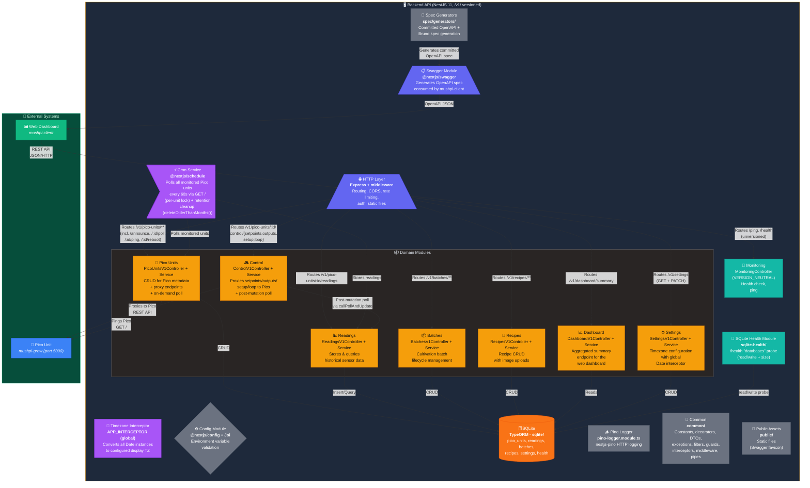

This page maps the inside of `mushpi-server` — the NestJS 11 backend. It shows the versioned HTTP layer, the domain modules, the cron polling and retention sweep, the SQLite store, and the infrastructure modules that support them.

## Controller Naming Convention

All controllers **except `MonitoringController`** carry a `V1` suffix in both class name and filename:

| Controller Class | Filename | Module |
|---|---|---|
| `PicoUnitsV1Controller` | `pico-units.v1.controller.ts` | Pico Units |
| `ReadingsV1Controller` | `readings.v1.controller.ts` | Readings |
| `BatchesV1Controller` | `batches.v1.controller.ts` | Batches |
| `RecipesV1Controller` | `recipes.v1.controller.ts` | Recipes |
| `ControlV1Controller` | `control.v1.controller.ts` | Control |
| `DashboardV1Controller` | `dashboard.v1.controller.ts` | Dashboard |
| `SettingsV1Controller` | `settings.v1.controller.ts` | Settings |
| `MonitoringController` | `monitoring.controller.ts` | Monitoring (VERSION_NEUTRAL) |

The `V1` suffix makes the version visually scannable in the codebase and prepares for future `/v2/` controllers alongside `/v1/` ones. The Swagger `operationIdFactory` strips the `V1` suffix from generated `operationId` values so the client contract remains stable (e.g., `BatchesController_create_v1`, not `BatchesV1Controller_create_v1`).

## Module Responsibilities

| Module | Path | Responsibilities |
|--------|------|-----------------|
| **Pico Units** | `src/modules/pico-units/` | Register (Pico boot announce via `POST /v1/pico-units/announce` — a collection route authenticated by the `X-Pico-Secret` header), list, get, update, delete. Proxies `/ping` to Pico `GET /`. **`POST /v1/pico-units/:picoUnitId/poll`** — on-demand Pico poll, stores a new reading via `ReadingsService`, returns `PicoUnit` with `latest_reading` embedded (201 Created). **`PUT /v1/pico-units/:picoUnitId/reboot`** — proxies reboot command to Pico (202 Accepted). |
| **Readings** | `src/modules/readings/` | Stores DHT11 readings from cron polling and on-demand polls. Time-range filtered queries. Validates Pico responses against `DeviceResponseDto` (`whitelist: true`). |
| **Batches** | `src/modules/batches/` | Full lifecycle: create (validates no overlap), update (time-gated fields), finish. Recipe linking snapshots target values. Image galleries (up to 5). |
| **Recipes** | `src/modules/recipes/` | CRUD with image upload. Editing does not affect historical batches (snapshot at link time). |
| **Control** | `src/modules/control/` | 1:1 proxy of Pico endpoints via `/v1/pico-units/:id/control/` prefix: `/control/setpoints`, `/control/outputs`, `/control/setup`, `/control/loop`. Guards prevent output changes while control loop is active. After every proxy operation, calls `callPollAndUpdate` to immediately re-poll the Pico so `latest_reading` reflects the new state. |
| **Settings** | `src/modules/settings/` | Timezone configuration with single-row `Settings` table (`id=1`). `GET /v1/settings` returns current timezone; `PATCH /v1/settings` updates it. `SettingsService` uses in-memory caching and defaults to the OS timezone when no row exists. `TimezoneInterceptor` is a global `APP_INTERCEPTOR` that recursively converts all `Date` instances and ISO-8601 UTC strings in API responses to the configured display timezone. Zero-cost passthrough when `timezone === 'UTC'`. The `SettingsModule` is decorated with `@Global()` so the interceptor can inject `SettingsService`. |
| **Cron** | `src/modules/cron/` | `@Cron('*/60 * * * * *')` polls monitored units. Creates `Readings` rows. Updates `last_seen`, board metadata and the unit's stored IP (refreshed when the poll reports one, preserved when absent). Failed units increment `failed_calls`. Uses **per-unit poll lock** — concurrent polls are only queued for the same unit, not globally blocked. Also runs the **retention cleanup** via `deleteOlderThanMonths()`, pruning `Readings` older than the configured retention window. |
| **Swagger** | `src/modules/swagger/` | Configures `@nestjs/swagger` with global error schemas. Auto-generates OpenAPI JSON at `/<DOCS_ENDPOINT>-json`. |
| **Monitoring** | `src/modules/monitoring/` | `GET /ping` (liveness), `GET /health` (full health check). These routes are **unversioned** (`VERSION_NEUTRAL`) — they remain at root, with no `/v1/` prefix. |
| **SQLite** | `src/modules/sqlite/` | TypeORM root — `data-source.ts` + entities, `autoLoadEntities`, better-sqlite3. Migrations live in `sqlite/migrations/` with a `MIGRATIONS` barrel. Note: the database module is `sqlite/` — there is no `database/`. |
| **SQLite Health** | `src/modules/sqlite-health/` | The `/health` "databases" probe — verifies SQLite read/write + size. |
| **Pino Logger** | `pino-logger.module.ts` | nestjs-pino HTTP request logging (a root module, not under `src/modules/`). |
| **Common** | `src/common/` | Shared cross-cutting code: constants, decorators, DTOs, exceptions, filters, guards, interceptors, middleware, pipes, utils, validators. |
| **Public** | `public/` | Static assets served at `/public` (the Swagger favicon). |
| **Spec Generators** | `spec/generators/` | Build-time OpenAPI + Bruno generators — produce the committed `spec/openapi.{json,yaml}` via `spec:all`. |

## PicoUnit Tracking Columns

The `PicoUnit` entity tracks three consecutive-failure counters, all of which reset to 0 on a healthy reading. The dashboard endpoint uses all three to classify unit health. The `PicoUnit` entity exposes a computed `status` getter (`@Expose()`) which the dashboard uses as the canonical health signal. The four states are:

- **unmonitored**: `monitored === false` — server is not polling this unit
- **healthy**: `monitored === true` and all failure counters are zero (`failed_calls=0`, `failed_readings=0`, `consecutive_empty_readings=0`)
- **degraded**: `monitored === true` with non-zero `failed_readings` or `consecutive_empty_readings` but no connectivity failures
- **offline**: `monitored === true` with non-zero `failed_calls` (connectivity lost)

The `DashboardUnitsDto` additionally exposes a `paused` count for unmonitored units, alongside healthy/degraded/offline counts.

| Column | Incremented When | Reset When |
|--------|-----------------|------------|
| `failed_calls` | Pico unit is unreachable (connection error, no response) | Any successful poll (valid or out-of-range reading) |
| `failed_readings` | DHT11 reading is outside sensor range (temperature 0–50°C, humidity 10–90%) | Next in-range reading |
| `consecutive_empty_readings` | Both `temperature` and `humidity` are `null` (sensor returned no data) | At least one sensor value is non-null |

### Compatibility verdict

Separate from the health `status`, the `PicoUnit` entity exposes a computed **`api_compatibility`** verdict (`@Expose()`). It judges the unit's reported `api_version` against the server's supported range and returns one of three states:

- **compatible** — the reported `api_version` is within the supported range
- **incompatible** — the reported `api_version` is outside the supported range
- **unknown** — the unit has never been contacted and has never reported a version

The verdict is stored and reported, but **never enforced** — an out-of-range `api_version` is flagged, not rejected.

## Polling Architecture

### On-demand poll (`POST /v1/pico-units/:picoUnitId/poll`)

Triggered by the frontend for immediate hardware state refresh. The endpoint:

1. Acquires a **per-unit poll lock** — only blocks concurrent polls on the same Pico unit (was previously a global lock that blocked all units).
2. Calls `GET /` on the target Pico, validates the response via `DeviceResponseDto` (`whitelist: true`, `forbidNonWhitelisted: false`).
3. Stores a new `Readings` row in SQLite.
4. Updates `last_seen` and board metadata on the `PicoUnit`, plus the unit's stored IP (refreshed when the poll reports one, preserved when absent).
5. Returns the `PicoUnit` entity with `latest_reading` relation embedded (201 Created).
6. Additionally returns an optional **`devices` block** containing live pin mapping from the Pico (`active_high`, `pins.dht/humidifier/fan/heater`) — wrapped in `PollPicoUnitResponseDto` via `IntersectionType(PicoUnit, DevicesMixin)`. This is not persisted — it passes through from the Pico to the client on every poll.

### State-visibility split: proxy vs. batch-orchestrated changes

Control-proxy endpoints (`setpoints`, `outputs`, `setup`, `loop`) use `callPollAndUpdate` — POST to the Pico then immediately poll, so `latest_reading` reflects the new state right away.

Batch-orchestrated changes (`applyBatchSettings`, `applyControlLoopDisable`, `applyUnitDisabled`) use `callSilent` — the Pico is updated but **no trailing poll** occurs. The server's `latest_reading` therefore lags the Pico's actual state by up to 60 s (the next cron tick). This is intentional: batch-driven changes are bulk operations where a per-unit poll would serialize and block the cron loop. The `POST /v1/pico-units/:picoUnitId/poll` endpoint exists for the frontend to force an immediate poll when needed.

### Client-side periodic refresh

The frontend triggers `POST /v1/pico-units/:id/poll` every 60 s on the unit detail page for live hardware data. Readings and batch pages re-fetch every 60 s via `refetchInterval` on their respective queries.

## Key Middleware & Guards

| Component | Type | Purpose |
|-----------|------|---------|
| `AppSecretBearerMiddleware` | Global middleware | Optional Bearer token auth from `APP_SECRET` env var |
| `ProtectEventLoopMiddleware` | Global middleware | `toobusy-js` overload rejection |
| `TimezoneInterceptor` | Global interceptor (`APP_INTERCEPTOR`) | Converts all `Date` instances and ISO-8601 UTC strings in API responses to the configured display timezone. Reads timezone from `SettingsService` (cached). Passthrough when `timezone === 'UTC'`. |
| `IsPicoUnitMonitoredGuard` | Guard | 410 Gone for unmonitored units |
| `IsControlLoopEnabledGuard` | Guard | 409 Conflict when control loop active (prevents manual output changes) |
| `TooManyRequestsGuard` | Guard | `@nestjs/throttler` rate limiting |
