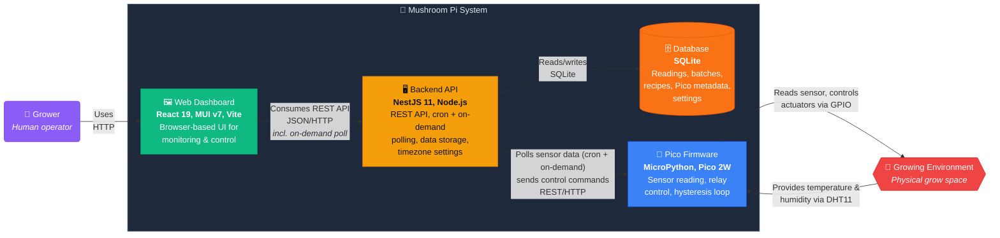

## Narrative

The runtime tiers run on a single hub machine — the hub runs on any Docker-capable single-board computer, and a Raspberry Pi 3 Model B v1.2 (1 GB) is what the maintainer tests on, so that is a known-good starting point, not a requirement. The dashboard and the API ship together in one published container image, serving both on port 3000.

### Web Dashboard (`mushpi-client`)
React 19 single-page application served from the hub's container — the same image and port 3000 as the backend API. Consumes the server's OpenAPI spec via auto-generated TypeScript client. Never talks to Pico units directly. Triggers on-demand Pico polls on page navigation and after control mutations for live hardware feedback.

### Backend API (`mushpi-server`)
NestJS 11 REST API running inside the hub's container. Six responsibilities:
1. **Cron polling**: Every 60 seconds, fetches sensor data from each monitored Pico unit and stores it as a Readings row.
2. **On-demand polling**: Exposes `POST /v1/pico-units/:id/poll` for the frontend to trigger an immediate poll — used on page mount, after control mutations, and for periodic 60 s background refresh on the unit detail page.
3. **Proxy**: Forwards control commands (setpoints, outputs, setup, control toggle) to Pico units, then immediately re-polls for up-to-date state.
4. **Serving**: Provides a REST API consumed by the web dashboard — readings, batches, recipes, Pico unit management.
5. **Aggregation**: Provides `GET /v1/dashboard/summary` — a single endpoint returning unit health (unmonitored/healthy/degraded/offline), `DashboardUnitsDto` counts (healthy, degraded, offline, paused), active/approaching/recently-finished batches, top recipes, global stats, and warnings (temp/humidity deviation, unit offline, empty readings).
6. **Settings**: Provides `GET /v1/settings` and `PATCH /v1/settings` for timezone configuration. A global interceptor (`TimezoneInterceptor`) converts all `Date` instances and ISO-8601 UTC strings in API responses to the configured display timezone. Zero-cost passthrough when the timezone is `UTC`.

### Pico Firmware (`mushpi-grow`)
MicroPython firmware on each Raspberry Pi Pico 2W. Runs a hysteresis-based control loop that toggles relays (humidifier, fan, heater) based on DHT11 readings vs. configured setpoints. Exposes a REST API on port 5000. Announces itself to the server on boot.

### Database
Single SQLite file in the hub's bind-mounted data directory: the host directory `MUSHPI_DATA_DIR` (default `./mushpi-data`) is mounted at `/data` in the container, and the database lives there as `app.sqlite`. Stores all application data: Pico unit metadata, sensor readings, cultivation batches, recipes, and global settings.

### Published Image & Compose (`mushpi-ops`)
The release/packaging repository wraps the containers above into the product a grower actually runs: a single published image, `ghcr.io/mushroom-pi/mushpi`, bundling the backend API and the built dashboard on one port (3000), plus the compose service definition that pulls that image and bind-mounts the host data directory at `/data`. `mushpi-ops` is not a runtime tier — it contains no application code; it packages the runtime. How the image is built and published is covered in [Release pipeline](/architecture/release-pipeline).

## Technology Stack

| Container | Language | Framework | Key Libraries |
|-----------|----------|-----------|---------------|
| Web Dashboard | TypeScript | React 19 | MUI v7, TanStack Query v5, Recharts v3, React Router v7 |
| Backend API | TypeScript | NestJS 11 | TypeORM, SQLite, Swagger/OpenAPI, @nestjs/schedule |
| Pico Firmware | MicroPython | — | Microdot (web), urequests (HTTP client) |
| Published Image & Compose (`mushpi-ops`) | Dockerfile | Docker Compose | GitHub Actions publish workflows, Buildx, GHCR |

## Development-Time Alternative

During development, demos, and screenshot capture, the **Pico Firmware** container can be substituted with `mushpi-mock` — a Python FastAPI service that mirrors the Pico REST API with hysteresis-simulated sensor data. Mock units announce themselves to the server and respond to polling identically to real Picos. From the server's perspective, there is no difference.

See [Mock Pico](/development/mock-pico) for the full mock documentation.
