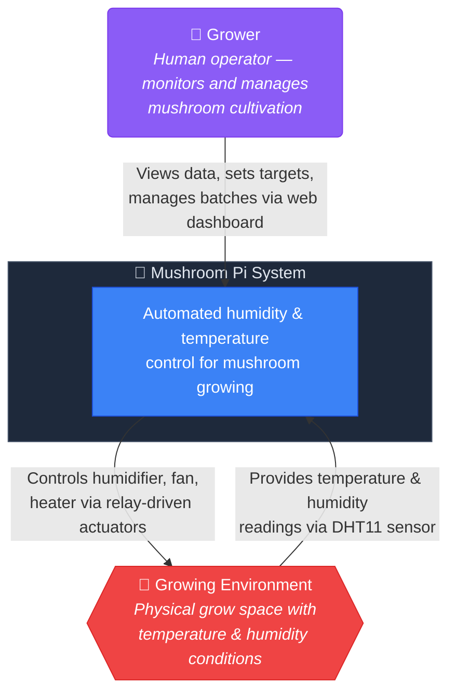

## Narrative

The Mushroom Pi system automates climate control for mushroom cultivation. A **grower** interacts through a web dashboard to monitor conditions, set temperature/humidity targets, and manage cultivation batches.

The system reads environmental data (temperature, humidity) from a DHT11 sensor and controls three actuators — a humidifier, a fan, and a heating mat — via relay switches running a hysteresis-based control loop.

Multiple Pico 2W units can be deployed, each controlling its own growing environment. The central server polls each unit, stores historical readings, and serves the data to the dashboard.

### External systems

- **Growing Environment**: The physical space. Not a software system — it's the real-world conditions the sensors measure and the actuators affect.
- **Grower**: The human operator. No direct system integration — interacts solely through the web dashboard.
