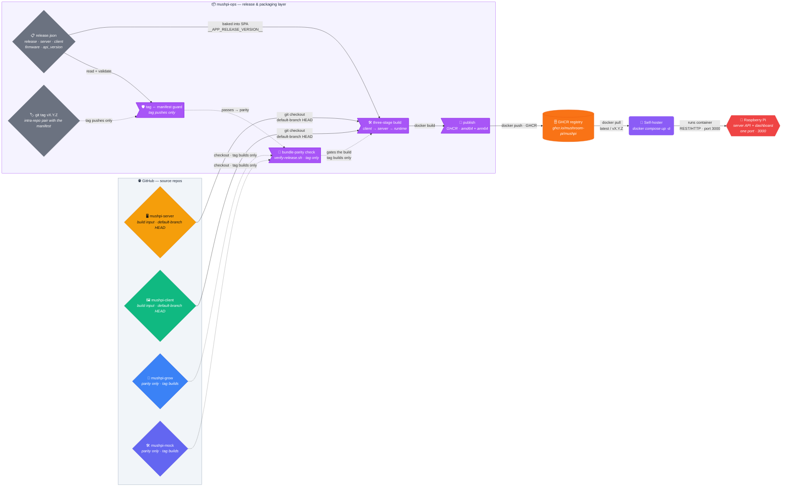

How the Mushroom Pi system is turned from a handful of sibling git repos into a single container image a grower can `docker compose up`, and how those repos relate to each other.

## What this layer is

`mushpi-ops` is the project's **release/packaging repository**. It is explicitly **not a runtime tier**: it contains no application code and never appears in the running system. What it *does* own is everything that sits between the source repos and the running container —

- the **container build** (`Dockerfile`),
- the **compose service definition** (`docker-compose.yml`),
- the **release manifest** (`release.json`),
- the **publish workflows** — `.github/workflows/publish.yml` (pushes to `main` and `v*` tags) and `.github/workflows/publish-dev.yml` (manual dispatch only, never moves `latest`) — sharing the composite build action `.github/actions/build-image/action.yml`.

The product of this layer is one artifact: a single image, `ghcr.io/mushroom-pi/mushpi`, that bundles the NestJS server API **and** the built React dashboard on one port (3000). Because the SPA is shipped inside the same image as the server it was generated against, a client↔server mismatch is physically impossible to ship — see `mushpi-ops/MAINTAINING.md` §Version & Release Semantics for the build-time-lockstep reasoning; this page documents how the image gets built and where it comes from.

The operational halves live in `mushpi-ops/MAINTAINING.md` (how a release is cut and shipped) and on this site's [deployment pages](/deployment/self-hosting) (how an operator runs it). This page is the architecture-level view: what the pieces are, how they connect, and what each protects against — it does not restate the mechanics.

## The pipeline

From source repos to a pulled image, the flow is: **materialize → guard → parity → build → publish → pull**.

### Reading the pipeline

**The source repos are never vendored.** The four rhombuses on the left are the *sibling* git repos, materialized by CI into the build context at **default-branch HEAD** — never copied into `mushpi-ops` and never pinned by the tag. `mushpi-server` and `mushpi-client` are the build inputs and are checked out on every build (solid edges). `mushpi-grow` and `mushpi-mock` are checked out **only on `v*` tag builds**, and only so the parity check has something to compare against — **firmware never enters the image** (dotted edges). The Pico is flashed over USB; the manifest is the only place a release records the firmware it was tested against.

**Two checks gate a tag build before anything reaches GHCR.** The **tag ⇔ manifest guard** (🛡️) verifies, at the tagged commit, that the pushed tag equals `release.json`'s `release` field, that the manifest has a valid shape (four SemVer strings plus an integer `api_version`), and that the manifest's `server`/`client` values match the sub-repos' `package.json` versions that CI just checked out — the last of these is what catches a tag cut before the sub-repo release commits were pushed. The **bundle-parity check** (🧾) then runs `scripts/verify-release.sh "${GITHUB_REF_NAME}"`, cross-checking the manifest against every committed component version (server/client `package.json`, grow `_SOFTWARE_VERSION` + spec, mock `VERSION`). Both are `if: startsWith(github.ref, 'refs/tags/v')` — a `main` push skips them entirely and goes straight to the build. This is why the guard is drawn as a *dotted* (conditional) chain while the materialize→build→publish spine is *solid*.

**Dev builds skip both checks.** `.github/workflows/publish-dev.yml` is manual-dispatch only: it builds the same image from a required free-form `image_tag` (plus an automatic `dev-sha-<short>` tag), skips the manifest guard and the parity check, and never moves `latest` — `latest` remains owned solely by `publish.yml`.

**The guard is intra-repo by design.** The tag, the manifest, and the workflow all live in `mushpi-ops`, so tag⇔manifest equality is checked inside one repository — no cross-repo lookup is needed for the pairing itself. The *manifest⇔code* and *parity* checks are what reach across repos, and they reach by checking out the siblings at HEAD, not by trusting the tag.

**Build and publish are unconditional once reached.** The three-stage `Dockerfile` builds the client (regenerating the gitignored API client from the server's committed OpenAPI spec, then type-checking and bundling), builds the server, and assembles a slim runtime. `release.json` is baked into the SPA during the client stage (the `__APP_RELEASE_VERSION__` sidebar footer — that's the `MANIFEST → BUILD` edge). The result is pushed to GHCR for both `linux/amd64` and `linux/arm64`.

**Self-hosters never build.** They `docker compose up -d` and pull the published image (`latest`, or a pinned `vX.Y.Z` to roll back). The right-hand side is the only part of this diagram a grower ever sees.

### Stage & artifact table

| Stage | What it is | Inputs | Outputs | Runs on |
|---|---|---|---|---|
| **Materialize** | CI checks out the siblings into the build context | GitHub source repos (`git`) | `mushpi-server/`, `mushpi-client/` (always) + `mushpi-grow/`, `mushpi-mock/` (tags only) | every build |
| **Manifest guard** | `release.json` vs the tag vs the code | git tag, `release.json`, checked-out `package.json` | pass / fail (halts before push) | `v*` tags only |
| **Bundle parity** | `verify-release.sh` | manifest + all four sub-repo versions + `jq` | pass / fail (halts before push) | `v*` tags only |
| **Build** | three-stage `Dockerfile` (client → server → runtime) | server + client sources, committed `spec/openapi.json`, `release.json` | image layers (one image, one port) | every build |
| **Publish** | `docker/build-push-action` | built image, GHCR credentials | `ghcr.io/mushroom-pi/mushpi` tags (`branch`, `vX.Y.Z`, `sha-…`, `latest`) | every build |
| **Pull & run** | `docker compose up -d` | published image | running container on the Raspberry Pi | self-hoster |

## Repository topology

The workspace is one orchestration root plus six repos. The orchestration root and the release repo are the two that are easy to conflate, because **neither is a runtime tier** — but they are not the same thing.

| Repo | Role | Remote | Enters the image? |
|---|---|---|---|
| `mushroom-pi/mushpi-orchestration` (orchestration root) | Agent definitions (`.opencode/agent/`), the full-stack overview, cross-repo contracts | `github.com/mushroom-pi/mushpi-orchestration` | never |
| `mushpi-ops` | Release/packaging layer (this page's subject) | `github.com/mushroom-pi/mushpi-ops` | its `Dockerfile`/compose/manifest *produce* the image, but as packaging, not application code |
| `mushpi-server` | NestJS backend API | `github.com/mushroom-pi/mushpi-server` | ✅ the server API |
| `mushpi-client` | React dashboard | `github.com/mushroom-pi/mushpi-client` | ✅ the built SPA |
| `mushpi-grow` | Pico 2W firmware (MicroPython) | `github.com/mushroom-pi/mushpi-grow` | ❌ parity record only — flashed over USB |
| `mushpi-mock` | Dev-only mock Pico service | `github.com/mushroom-pi/mushpi-mock` | ❌ parity record only |
| `mushpi-docs` | Documentation (this repo) | `github.com/mushroom-pi/mushpi-docs` | ❌ |

**Orchestration root vs release repo.** The orchestration root is the *workspace super-directory* — it owns the agent definitions and the cross-repo contracts, and is where development coordination happens. The release repo is a *shipping* git repo: it has CI, and it is the thing whose tag triggers the publish. The root coordinates the agents that produce the code; `mushpi-ops` packages that code into the artifact. Neither runs at runtime — but only one of them publishes anything.

## Artifact identity

**The image is named for the product, not the publishing repo.** The image is `ghcr.io/mushroom-pi/mushpi`, published *by* `mushroom-pi/mushpi-ops`. The name is pinned as `${{ github.repository_owner }}/mushpi` — the owner interpolates, but the image name (`mushpi`) is a deliberate product decision, not a side effect of the repo name. Renaming the repo would not rename the image.

**The manifest/tag pairing.** A release is two things kept in lockstep: a git tag `vX.Y.Z` and a committed `release.json` at the repo root, changed in one commit. `release.json` records the five fields — `release` (equals the tag without the `v`), `server`, `client`, `firmware`, and integer `api_version` — that pin the exact component combination tested together. The tag pins only `mushpi-ops`'s own files; the sub-repos always build at default-branch HEAD, which is why their release commits must be pushed before the tag. Semantics live on the [Releases](/releases) page; the normative rules and the mechanical release procedure live in `mushpi-ops/MAINTAINING.md` (§ Version & Release Semantics).

## Related reading

- [Releases](/releases) — what a version means (reader-facing); the normative semantics — the manifest schema and the client↔server lockstep — live in `mushpi-ops/MAINTAINING.md` §Version & Release Semantics.
- `mushpi-ops/MAINTAINING.md` — how to cut and ship a release (mechanics); it also keeps the release-repo packaging notes.
- [Self-hosting](/deployment/self-hosting) and the other [deployment pages](/deployment/environment) — how an operator runs the deployed system.
- [Container view](/architecture/c4-container) — the three runtime containers this layer packages.
