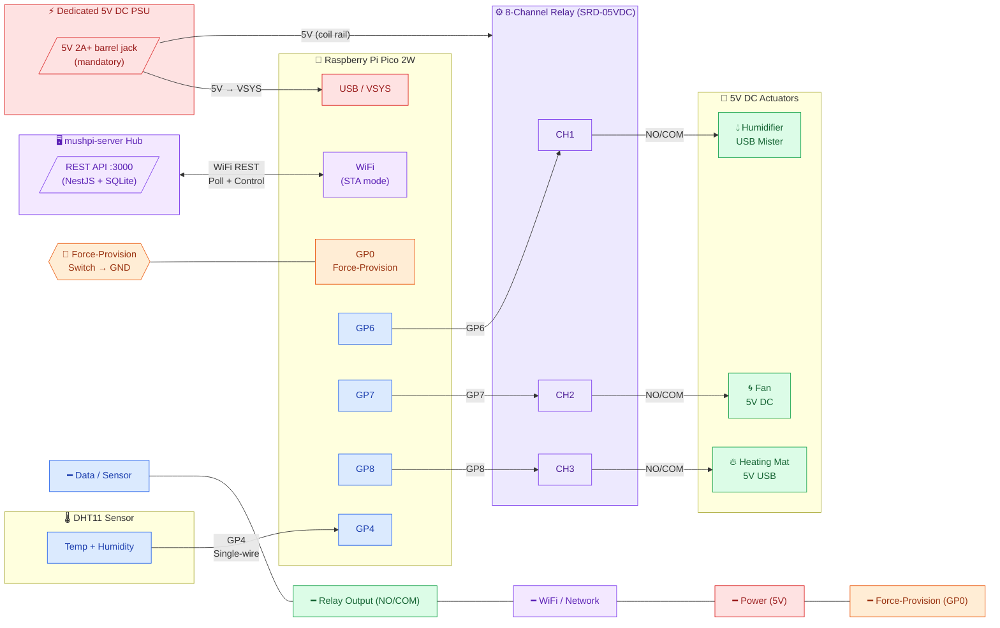

This page is the hardware reference for one Mushroom Pi grow unit. It lists what the **tested build** actually uses — labelled honestly as a reference implementation, not a mandatory shopping list — and, alongside it, what each part has to be able to do. A grower can substitute any equivalent part that meets the capability requirements without being told ours are the only ones that work.

## System orientation

The diagram orients the parts before you buy them. The **hub** — `mushpi-server` running in Docker on any single-board computer — talks to each unit over Wi-Fi, polling readings and sending control commands. Inside the unit, a **Raspberry Pi Pico 2W** reads the **DHT11 sensor** on one GPIO pin and drives a **relay module** on three more. The relay module switches the three **5 V actuators** — humidifier, fan, and heating mat — on the 5 V rail, and a **dedicated 5 V supply** powers both the relay module and the Pico. A **force-provision switch** on GP0 is the only other input. The pin-level wiring is on the [Wiring](/hardware/wiring) page.

## Reference implementation (the tested build)

| Part | Model / variant | Notes |
|---|---|---|
| Microcontroller | Raspberry Pi Pico 2W | RP2350, dual-core, built-in Wi-Fi |
| Temperature & humidity sensor | DHT11 (4-pin module) | Single-wire digital; chequered accuracy |
| Relay module | 8-channel 5 V relay (SRD-05VDC) | Channels 1–3 used; 5 channels spare; active-low by default; optocoupler-isolated |
| Humidifier | Ultrasonic mist maker (USB-powered) | Switched by relay channel 1 |
| Fan | 30×30×10 mm 5 V DC brushless | Switched by relay channel 2; air circulation |
| Heating mat | Low-wattage USB heating mat (5 V) | Switched by relay channel 3 |
| Power supply | 5 V / 2 A+ DC (barrel jack) | Dedicated to the relay module and actuators — not run through the Pico's USB port |

The relay module has **eight channels; only three are used** (humidifier = channel 1, fan = channel 2, heater = channel 3). The remaining five channels stay spare.

## Capability requirements (what you may substitute)

Each role only needs to meet these requirements — the specific part above is what the maintainer happens to test, not what you must buy.

| Role | Requirement |
|---|---|
| Microcontroller | Runs MicroPython, hosts Wi-Fi, and exposes the GPIO pins the firmware needs — the Pico 2W is the tested choice because it has Wi-Fi built in |
| Temperature & humidity sensor | A DHT11-compatible single-wire sensor the firmware can read |
| Switching | Low-voltage DC switching for the actuators, rated for the actuator current — the relay module switches the 5 V rail only, and never carries mains |
| Each actuator (humidifier, fan, heater) | A 5 V DC load that does the environmental work: add moisture, move air, add heat |
| Power supply | A supply with enough current headroom for the full load — see [Power](/hardware/power) for the load table and why 5 V / 2 A+ is the tested minimum |

All of the Pico-side components are widely available from electronics distributors (Adafruit, SparkFun, Pimoroni, AliExpress, Amazon); search for "Raspberry Pi Pico 2W", "DHT11 module", and "5V 8-channel relay module".

## Server host

The hub runs the backend and dashboard in a single container. You need one host on your local network to run it.

| Part | Qty | Notes |
|---|---|---|
| Docker-capable SBC or Linux host | 1 | Any Docker-capable single-board computer — the Raspberry Pi 3B+ (with a 64-bit OS) is the tested bare-minimum reference |
| microSD card — 16 GB or larger | 1 | Stores the OS, container image, and SQLite database |
| Power supply for the host | 1 | e.g. the official Raspberry Pi 3 PSU (5 V / 2.5 A micro-USB) for a Pi 3B+ |
| Ethernet or 2.4 GHz Wi-Fi | — | The hub must be reachable on the same network as the Pico units |

## Optional components

| Component | Notes |
|---|---|
| Half-size or full-size breadboard | Useful for prototyping before soldering or using an enclosure |
| Pin headers for Pico | Pre-soldered on some variants; required if yours is headerless |
| Enclosure / project box | Protects the electronics in a real grow environment |

## Server hosting alternatives

The container image (`ghcr.io/mushroom-pi/mushpi`) runs on any Linux host with Docker installed — an existing home server, a NUC, or a cloud VM all work. The Pico units reach the server over your local network (or via Tailscale for remote access), so the host only needs a stable address on the same network as the Pico units.
