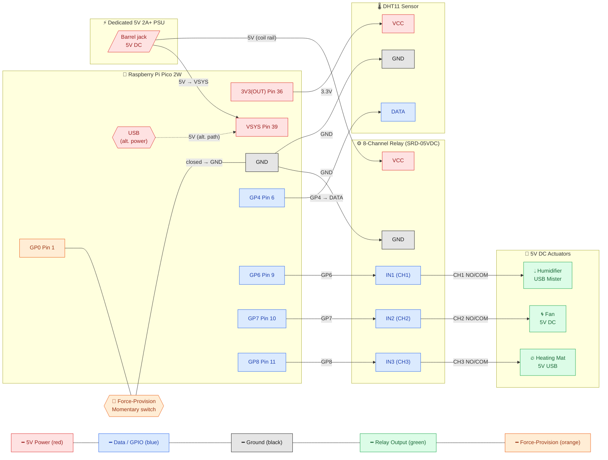

The pin map on this page is a **set of defaults, not a fixed wiring**. The firmware ships with the DHT11 on **GP4** and the relays on **GP6 / GP7 / GP8**, and those assignments are configurable — you can change them in `config.json` (see [Changing the pin assignments](#changing-the-pin-assignments)). The defaults are documented first, then how to change them.

> **No mains voltage.** Every part in this build runs on 5 V DC or 3.3 V DC. The relay module switches the low-voltage side only — there is no 110 V / 230 V mains anywhere in the unit. Never connect mains to the relay module.

## Wiring overview



The diagram shows the four kinds of connection, colour-coded by signal — **data/GPIO** (blue), **5 V power** (red), **ground** (black), **relay outputs** (green), and the **force-provision** input (orange):

- The Pico's **GP4** carries the DHT11's single-wire data line; **GP6, GP7 and GP8** drive the relay inputs IN1, IN2 and IN3 (humidifier, fan, heater).
- The **dedicated 5 V supply** feeds both the relay module's coil rail and the Pico's VSYS pin (39); the Pico's 3V3(OUT) pin powers only the DHT11, not the relays. USB is shown as an alternative power path for the Pico.
- All devices share a common **ground**.
- The relay channels switch the three actuators on the **5 V rail** — each relay's NO/COM contact pair sits between the 5 V supply and its actuator, not between the Pico and the actuator.
- The **force-provision switch** is a momentary switch from GP0 to ground; closing it at boot pulls GP0 low and arms provisioning mode.

## Wiring steps

### 1. Connect the DHT11 sensor

The DHT11 has three pins (some breakout modules add a fourth pull-up-resistor pin — check your board's silkscreen):

- **VCC → Pico pin 36 (3V3 OUT)** — 3.3 V power for the sensor
- **GND → any Pico GND pin** (e.g. pin 38)
- **DATA → GPIO 4 (pin 6)** — the firmware default; the internal pull-up is used

If your DHT11 is a bare component rather than a module, add a 10 kΩ pull-up resistor between DATA and VCC.

### 2. Connect the relay module

Most 5 V relay modules accept 3.3 V logic signals from the Pico's GPIO pins:

- **VCC → the dedicated external 5 V supply** — the module's coils are 5 V components (~70 mA per active channel) and must not draw from the Pico's 3.3 V regulator
- **GND → any Pico GND pin** (common ground with the 5 V supply)
- **IN1 (humidifier relay) → GPIO 6 (pin 9)** — firmware default
- **IN2 (fan relay) → GPIO 7 (pin 10)** — firmware default
- **IN3 (heater relay) → GPIO 8 (pin 11)** — firmware default

Most relay modules are **active-low**: the relay energises when the GPIO is pulled LOW. The firmware defaults to this (`active_high: false` in `config.json`); verify that your module matches.

### 3. Connect the actuators to the relay contacts

Each actuator is switched on the 5 V rail by its relay's normally-open (NO) and common (COM) contacts — the relay sits between the 5 V supply and the actuator, so the actuator only receives power when its relay is energised:

- **Humidifier** — channel 1 (NO1/COM1)
- **Fan** — channel 2 (NO2/COM2)
- **Heating mat** — channel 3 (NO3/COM3)

For the USB-powered actuators (humidifier, heating mat), the 5 V line of the USB cable is cut and interrupted by the relay's NO/COM pair; the ground passes through. The fan is a bare 5 V DC motor wired the same way. All three remain 5 V DC — no part of an actuator connects to mains.

### 4. Connect the force-provision switch

A **momentary switch between GP0 (pin 1) and GND** arms provisioning mode: hold it closed during boot to force the unit into its access-point setup flow, even when Wi-Fi credentials are already configured. GP0 has an internal pull-up (33 kΩ–60 kΩ), so the switch alone is enough — closing it pulls the pin low. The full flow is on the [Provisioning](/hardware/provisioning) page.

### 5. Connect the dedicated 5 V supply

Power the relay module's VCC and the actuator circuits from a **dedicated 5 V / 2 A+ DC supply** — their combined draw exceeds what the Pico's USB port can provide, so the supply is mandatory and is not run through the Pico's USB port. The Pico itself can be powered via USB or its VSYS pin (39). During development you can power the Pico from your computer's USB port and use the same cable for flashing and serial-console access. The supply requirement and load table are on the [Power](/hardware/power) page.

## Pin mapping reference (defaults)

| Component | Pico physical pin | GPIO | Notes |
|---|---|---|---|
| Force-provision input | 1 | GP0 | Internal pull-up; held LOW at boot to force AP provisioning |
| DHT11 VCC | 36 | — | 3V3 OUT rail |
| DHT11 GND | 38 | — | Any GND pin works |
| DHT11 DATA | 6 | GP4 | Firmware default; internal pull-up used |
| Relay VCC | — | — | External 5 V from the dedicated supply — never the Pico's 3V3 pin |
| Relay GND | 38 | — | Common ground — any GND pin works |
| Relay IN1 — humidifier | 9 | GP6 | Active-low by default |
| Relay IN2 — fan | 10 | GP7 | Active-low by default |
| Relay IN3 — heater | 11 | GP8 | Active-low by default |

## Changing the pin assignments

The four GPIO numbers above live in `config.json` on the unit, under the `pins` key:

```json
"pins": { "dht": 4, "humidifier": 6, "fan": 7, "heater": 8 }
```

Edit these values (then redeploy `config.json`) to move a device to a different pin, and keep your physical wiring in step.

- `active_high` (a sibling key) flips relay polarity; `false` is active-low, the default.

The pin map can also be changed at runtime via the unit's `POST /setup` endpoint, which persists to `config.json` so the change survives a reboot.

### GPIO validation

Pin assignments are checked by **mushpi-server** when you send them to `PUT /v1/pico-units/:id/control/setup`, and then checked again by the unit's firmware when the server forwards them.

- **Valid range, server-side:** integers only, and only pins in the set `0–22, 26, 27, 28`. GP23, GP24, GP25 and GP29 are reserved by the CYW43439 (Wi-Fi/Bluetooth) and are rejected with **422**.
- **GP0 cannot be assigned.** The firmware reads GP0 at boot to decide whether to enter provisioning mode, and it rejects pin 0 with **400** — which the server reports to you as **417 Expectation Failed**. Nothing is applied. This is deliberate, and it is why the force-provision switch is wired to GP0.
- **No duplicates — a merged-view rule.** Duplicate detection overlays the pins in your request on the unit's current mapping and checks the combined result, so a conflict with a pin the unit already uses is caught — not just two pins inside one request. **The server checks first:** it reads the unit's live mapping and rejects a conflict with **422** before forwarding anything to the device. **The firmware checks too**, rejecting directly with **400** — so does the mock, which mirrors the firmware's behaviour for development. The rule set is deliberately identical in all three layers; the duplication is on purpose, not an accident.
- **What the merged view allows** — the cases a grower actually hits: re-assigning a device to the pin it already holds is fine (an idempotent re-send), and a pin freed by another device *within the same request* is fine (a swap). Only a conflict the request creates or keeps alive is rejected.

Direct calls to the Pico bypass the server's validation entirely. The firmware's own checks are `integer in 1..29` and the same merged-view duplicate rule, both returning **400**; it never rejects a reserved GPIO (GP23, GP24, GP25 and GP29 pass the range check), and no clamping or fallback occurs.

## After wiring

Once all the connections are secure, flash the MicroPython firmware — see [Pico Firmware](/hardware/pico-firmware). After a successful boot the Pico exposes its REST API on **port 5000**; you can confirm it is reachable from any device on the same network at `http://<pico-ip>:5000/health`.
